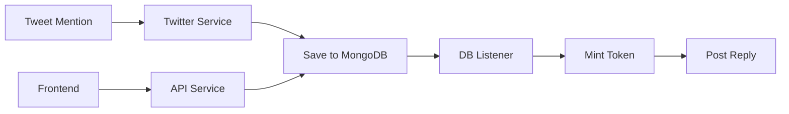

# Guide d'intégration Twitter pour CoinLaunch

## 🏗️ Architecture

Le système CoinLaunch est maintenant divisé en deux services :

1. **API Service** (`apps/api`) - Port 5050
   - Gère les endpoints principaux
   - Upload IPFS
   - Trading et liquidité

2. **Twitter Service** (`apps/twitter`) - Port 5051
   - Écoute les mentions Twitter
   - Mint les tokens via escrow wallets
   - Poste des commentaires
   - Gère les claim fees

## 🚀 Démarrage rapide

### 1. Installation des dépendances

```bash
# Depuis la racine du projet
pnpm install
```

### 2. Configuration

Créez les fichiers `.env` dans chaque app :

```bash
# API Service
cp apps/api/.env.example apps/api/.env

# Twitter Service  
cp apps/twitter/env.example apps/twitter/.env
```

### 3. Démarrer les services

#### Option A : Tout démarrer ensemble
```bash
pnpm dev:all
```

#### Option B : Démarrer séparément
```bash
# Terminal 1 - API Service
pnpm dev:api

# Terminal 2 - Twitter Service
pnpm dev:twitter
```

#### Option C : Utiliser Turborepo
```bash
# Démarre tous les services en parallèle
pnpm dev
```

## 🔧 Configuration Twitter

### 1. Créer une app Twitter Developer

1. Allez sur [developer.twitter.com](https://developer.twitter.com)
2. Créez un projet et une app
3. Activez OAuth 2.0 avec les scopes :
   - `tweet.read`
   - `tweet.write`
   - `users.read`
   - `offline.access`

### 2. Configurer les variables d'environnement

Dans `apps/twitter/.env` :

```env
# Bearer Token pour écouter les mentions
X_APP_BEARER_TOKEN=your_bearer_token_here

# OAuth2 pour poster des réponses
X_CLIENT_ID=your_client_id
X_CLIENT_SECRET=your_client_secret
X_OAUTH_2_REDIRECT_URL=http://localhost:5051/auth/twitter/callback
USER_X_ID=your_twitter_user_id
```

### 3. Authentifier l'application

1. Démarrez le Twitter Service
2. Visitez : http://localhost:5051/auth/twitter/login
3. Autorisez l'application sur Twitter
4. Vous serez redirigé et l'auth sera sauvegardée

## 🧪 Tester l'intégration

### 1. Test système
```bash
cd apps/twitter
npm test
```

### 2. Test d'intégration
```bash
cd apps/twitter
node test-integration.js
```

### 3. Mode Mock (sans API Twitter)

Dans `apps/twitter/services/XService.js` :
```javascript
static ShouldMock = true;
```

Cela simulera des tweets toutes les 30 secondes.

## 📊 Flow de données



## 🔐 Sécurité

### Escrow Wallets
- Chaque utilisateur Twitter a un wallet unique
- Les clés privées sont chiffrées en DB
- Le funding wallet finance les gas fees

### Variables sensibles
```env
# IMPORTANT - Ne jamais commiter
ESCROW_ENCRYPTION_KEY=32_bytes_hex_key
FUNDING_PRIVATE_KEY=private_key_with_eth
```

## 🐛 Troubleshooting

### Erreur "ECONNRESET" sur le stream Twitter
- Vérifiez votre Bearer Token
- Activez le mode Mock temporairement
- Vérifiez les rate limits

### MongoDB connection failed
- Assurez-vous que MongoDB tourne
- Vérifiez MONGO_URI dans les deux `.env`

### Minting échoue
- Vérifiez BONDING_CURVE_MANAGER_ADDRESS
- Assurez-vous que le funding wallet a des ETH
- Vérifiez ETH_RPC_URL

## 📝 Endpoints utiles

### Twitter Service (5051)
- `GET /` - Health check
- `GET /auth/twitter/status` - Statut OAuth2
- `POST /test/mint-token` - Test minting
- `GET /claim-fees/check/:username` - Vérifier fees

### API Service (5050)
- `GET /tokens` - Liste des tokens
- `POST /upload-to-ipfs` - Upload images
- Routes de trading...

## 🚀 Production

Pour la production :
1. Utilisez des variables d'environnement sécurisées
2. Configurez un système de gestion de clés (KMS)
3. Mettez en place du monitoring
4. Utilisez des rate limits
5. Configurez des webhooks pour le frontend 